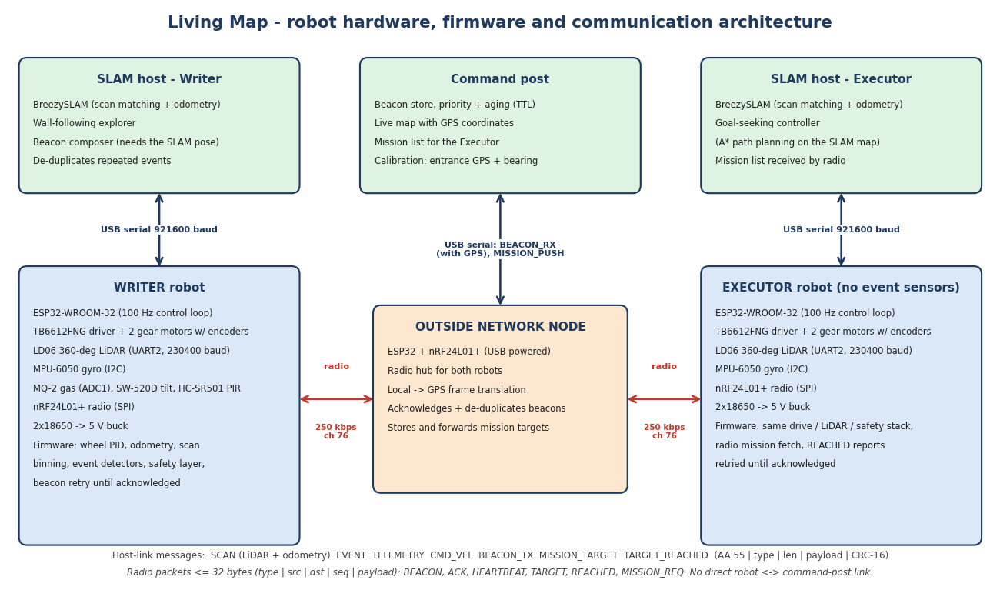

# Robot Hardware, Firmware and Communication

*What each robot is made of, how it is programmed, and how the pieces talk to each other. Code: `firmware/` (ESP32, C++), `base_station/` (SLAM host, Python), `comms/` (beacons, command post). Figures marked "sim" come from the software-in-the-loop simulation described in Section 5.*

## 1. What the robot consists of

The Writer and Executor share one base. The Writer adds the three event sensors. The outside network node is an ESP32 with a radio and nothing else. Prices are rough estimates in USD and will be confirmed against supplier quotes.

| Block | Part | Why this part | Est. cost |
|---|---|---|---|
| Microcontroller | ESP32-WROOM-32 DevKit (x3) | Dual core, 240 MHz, hardware PWM, 3 UARTs, I2C, SPI, plenty of interrupt-capable pins; cheap and well documented | $15-21 |
| Drive | TB6612FNG driver + 2 DC gear motors with quadrature Hall encoders + 65 mm wheels (per robot) | 3.3 V logic, 1.2 A per channel, PWM at 20 kHz (silent). Encoders are required: SLAM needs wheel odometry | $17-26 per robot |
| Heading | MPU-6050 (gyro Z only) | Gyro heading removes wheel-slip error during turns | $3-5 per robot |
| Perception | LD06 360-degree LiDAR (UART, 230400 baud) | Cheapest true 2D spinning LiDAR; output is a simple packet stream | about $70-100 per robot |
| Gas | MQ-2 module | Anomaly trigger above a learned baseline (not a calibrated measurement) | $2-4 |
| Collapse | SW-520D tilt/vibration module | Several trips in 1 s = collapse; no library or calibration | $1-2 |
| Trapped worker | HC-SR501 PIR | Detects a warm body that moves; needs a warm-up and a stationary robot | $2-3 |
| Radio | nRF24L01+ (x3), PA+LNA version if range tests need it | 250 kbps gives the best sensitivity; 32-byte packets with hardware ACK and retries | $4-8 |
| Power | 2x 18650 (7.4 V) -> motor driver; 5 V buck -> ESP32, LiDAR, PIR, MQ-2 | Motors and logic on separate regulators so motor noise does not reset the ESP32 | $8-12 per robot |

The wiring table (ESP32 pins, which are input-only, which are boot-strapping pins and so avoided) is in `firmware/include/pins.h`. Two details that matter: the MQ-2 analog output is 0-5 V, so it goes through a 10k/15k divider (3.0 V maximum) to an ADC1 pin; and the nRF24 needs a clean 3.3 V supply and a 10 uF capacitor at the module. All pin choices are untested on real hardware and are listed in the bring-up checklist in `firmware/README.md`.

## 2. How the system is split between the ESP32 and the SLAM host

An ESP32 cannot run BreezySLAM, so the work is divided by what needs real-time guarantees:

- **ESP32 (real time, C++):** 100 Hz wheel-speed control, encoder + gyro odometry, LD06 packet parsing and scan binning, event-sensor logic, the safety layer, nRF24 reliability, and framing for the host link. It keeps the robot safe even if the host is slow or silent.
- **SLAM host (Python, laptop for Phase 2, a Raspberry Pi later; the code is identical):** BreezySLAM, the existing wall-following and goal-seeking controllers, and beacon composition (a beacon needs the SLAM pose, which only the host has). The ESP32 sends it one scan plus the odometry since the previous scan, 10 times per second, and gets back a velocity command.

## 3. Communication design

There are four links. Nothing crosses from a robot to the command post directly; everything goes through the outside network node.

| Link | Physical layer | Contents | Load |
|---|---|---|---|
| ESP32 <-> LD06 | UART2, 230400 baud, receive only | 47-byte packets, 12 points each, CRC-8 | about 17.6 kB/s of 23 kB/s |
| ESP32 <-> SLAM host | USB serial, 921600 baud (TCP in simulation) | Framed binary messages (below) | about 7.6 kB/s of 92 kB/s |
| Robot <-> outside node | nRF24L01+, 2476 MHz (channel 76), 250 kbps, hardware ACK, 15 retries | 32-byte packets (below) | well under 1 % duty cycle |
| Outside node <-> command post | USB serial, same framing as the host link | Beacons with GPS, mission list, calibration | negligible |

**Host-link frame:** `AA 55 | type | length (2 bytes) | payload | CRC-16`. The parser resynchronises after noise and rejects corrupt frames. Robot to host: `SCAN` (360 range bins of 1 degree, plus odometry distance, heading change and time since the previous scan), `EVENT`, `TELEMETRY`, `BEACON_STATUS`, `MISSION_TARGET`. Host to robot: `CMD_VEL`, `SET_MODE` (run, idle, emergency stop), `BEACON_TX`, `TARGET_REACHED`, `MISSION_REQ`. Outside node: `BEACON_RX` (with GPS), `TARGET_REACHED`, `NODE_STATUS`, `SET_CALIB`, `MISSION_PUSH`.

**Radio packet:** `type | source | destination | sequence | payload`, at most 32 bytes. Types: `BEACON` (the 16-byte beacon), `ACK`, `HEARTBEAT` (state, position, battery, faults every 2 s), `TARGET` (index, count, beacon), `REACHED`, `MISSION_REQ`. Addresses are `LMNT` plus one byte (hub 0x10, Writer 0x01, Executor 0x02), so each node has a fixed address and the hub is the only node both robots talk to.

**Reliability.** The nRF24 hardware ACK and retries only guarantee that the radio chip received the packet. On top of that, every important message has an application-level acknowledgement:

- A Writer keeps re-sending a beacon at its priority's rebroadcast interval (2 s, 5 s or 10 s) until the hub acknowledges it, or until its TTL runs out (beacons live 150 s, 360 s or 600 s). The hub acknowledges every copy but forwards only the first (de-duplication).
- The Executor repeats its mission request until it has received every target in the list, and repeats each `REACHED` report until the hub acknowledges it. In testing this found two real bugs (a lost target stayed lost; two quick reports overwrote each other), both fixed.
- A radio failure never stops the robot. It raises a fault flag and the robot keeps driving; only the beacon delivery is delayed.

**Time.** Beacon aging assumes all nodes share one mission clock. The simulation provides it; real hardware needs a start-of-mission clock sync (listed in the failure cases).

## 4. How the robot is programmed

The firmware is C++ (Arduino-ESP32 framework, built with PlatformIO). All logic is in a hardware-independent core and reaches the hardware only through one interface (`hal.h`). That is what makes it testable: the same `apps.cpp` runs on the ESP32 and, compiled for a PC, inside the simulation. One image per role is built from the same source (`pio run -e writer`, `-e executor`, `-e hub`).

**Robot state machine:** BOOT -> WARMUP (gyro bias calibration over 100 samples; wait for LiDAR packets) -> READY -> RUN (started by the host) <-> VERIFY (Writer only) -> EMERGENCY STOP (latched until the host sends IDLE).

**Safety layer (runs on the ESP32, independent of the host):**

| Condition | Response |
|---|---|
| No velocity command for 500 ms | Stop |
| No LiDAR data for 1 s | Stop; resume automatically when data returns |
| Obstacle inside the forward cone (30 degrees either side) closer than the stop distance | Block forward motion; turning in place still allowed |
| Emergency stop command | Motors off immediately; running is refused until cleared |
| Gyro stops responding | Fall back to encoder-only heading, flag the fault |
| Radio down | Flag only; the robot keeps working |

**Event detection (Writer):** thresholds are parameters in `firmware/include/params.h`.

| Sensor | Rule | Why |
|---|---|---|
| MQ-2 gas | ADC counts more than 350 above a slowly learned clean-air baseline for 1.5 s; ignored during the 60 s warm-up | Drift and brief spikes should not raise an alarm |
| SW-520D tilt | At least 3 trips within 1 s | The ball bounces and the robot's own bumps trip it |
| HC-SR501 PIR | A rising edge while driving makes the robot stop; if the PIR is still active 0.8 s after settling (up to 3 s), a trapped worker is declared | The robot's own motion changes what the PIR sees; a single blip is counted as a false alarm |

After an event, the host adds the SLAM position, drops repeats of the same incident within 3 m, and returns the beacon for the firmware to send.

**Path from sensor to Executor:** sensor -> event detector -> `EVENT` -> host composes the beacon -> `BEACON_TX` -> radio -> outside node (ACK, GPS translation) -> `BEACON_RX` -> command post (mission list sorted by priority, expired beacons dropped) -> `MISSION_PUSH` -> outside node -> radio -> Executor firmware -> `MISSION_TARGET` -> Executor host (A* path planning over its own SLAM map) -> `CMD_VEL` -> wheel PID -> motors. On arrival the Executor sends `TARGET_REACHED`, which travels back over the radio to the command post.

## 5. What has been verified, and what has not

**Verified (software only):**

- 57 unit checks on the portable core (framing, CRC, LiDAR parsing, odometry, PID, detectors, beacon retry and aging) and 62 behaviour checks on the real firmware code running on a simulated bench (boot, closed-loop driving, every safety condition, every event sensor, hub, lossy radio, mission hand-over).
- Full mission in the PyBullet mine, with the real firmware driving, the real SLAM and controllers, the radio medium and the command post. With a perfect radio: the Writer finishes in 476 s and 148 m with mean position error 0.25 m (maximum 0.45 m) and no wall contacts; 3 beacons are composed (6 repeats suppressed), acknowledged and delivered; the Executor visits 3 of 3 in 144 s with maximum error 0.26 m and no wall contacts. With 50 % of radio sends failing (234 failed sends), the result is the same, with 2 duplicate beacons correctly discarded.
- The ESP32 glue code passes a syntax check against stub headers for all three roles.

**Not verified:**

- Nothing has been built with the real ESP32 toolchain or run on hardware. Pin choices, encoder and motor directions, the tilt-switch polarity, the LD06 CRC and angle direction, and radio range underground are assumptions to check at bring-up.
- The simulated sensor chain is idealised in places (no radio interference, no dust on the LiDAR, no real MQ-2 drift). The position error is higher than the earlier ideal simulation (0.25 m against 0.14 m mean), which is the expected cost of a realistic sensor path.
- Battery level is not measured (all ADC1 pins are in use), so telemetry reports it as unknown.
